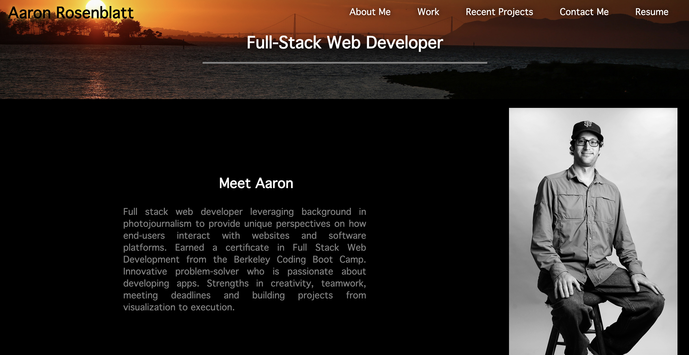

# Portfolio
## By Aaron Rosenblatt
#### I created a portfolio from scratch. The "Header" section includes links to other sections in the website and my resume using list and anchored elements. The "About Me" section contains an image of myself styled with a brief description of myself within an article. The "Work" section includes a grid with screenshots showing examples of my projects and links to those projects as well. Each link contains a "box-text" with a brief title and description of my projects. My most recent project is larger in size than the others and each image fades slightly when the mouse hovers over it. The "Contact Me" section consists of anchor and lists elements that link to my email and social media sites. I made my portfolio using HTML and CSS, and the layout adaps to various screen sizes, including smart phone and tablet screens.

### The GitHub repository for my portfolio can be viewed here: https://github.com/noplur/portfolio
### The link to the website of my portfolio can be viewed here: https://noplur.github.io/portfolio/

### Here is a screenshot of my portfolio website:
### 